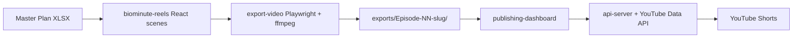

# BioMinute Shorts Studio 🎬

> AI-powered health-science YouTube Shorts production pipeline — from master plan spreadsheet to published video.

[](VERSION.md)
[](LICENSE)
[](https://nodejs.org)
[](https://www.typescriptlang.org)
[](https://pnpm.io)
[](https://react.dev)
[](https://github.com/0utLawzz/biominute-shorts-studio)

## What is this?

**BioMinute Shorts Studio** is a monorepo production system for the **BioMinute** health channel — 60-second, science-backed YouTube Shorts. Full episode lifecycle: spreadsheet master plan → animated scenes → export → review → publish.

---

## Pipeline flow



---

## Workspace layout (core)

| Package / path | Role |
|----------------|------|
| `artifacts/biominute-reels` | Animated episode scenes |
| `artifacts/publishing-dashboard` | Review, approve, metadata |
| `artifacts/api-server` | API + YouTube publish |
| `lib/db` | Drizzle / Postgres |
| `exports/` | Generated episode media |
| `docs/` | INSTALL, RUN, USAGE |

---

## Quick start

```bash
git clone https://github.com/0utLawzz/biominute-shorts-studio.git
cd biominute-shorts-studio
pnpm install
pnpm --filter @workspace/db push-force
pnpm --filter @workspace/scripts exec tsx ./src/seed-episodes.ts
# Start api-server, publishing-dashboard, biominute-reels in separate terminals
```

Full docs: [`docs/INSTALL.md`](docs/INSTALL.md) · [`docs/RUN.md`](docs/RUN.md) · [`docs/USAGE.md`](docs/USAGE.md)

---

## Contributing & Security

- [CONTRIBUTING.md](CONTRIBUTING.md)
- [SECURITY.md](SECURITY.md)
- [CODE_OF_CONDUCT.md](CODE_OF_CONDUCT.md)

---

## License

MIT © BioMinute Studio / Nadeem (OutLawZ) — see [LICENSE](LICENSE).

---

## Author

**Nadeem (OutLawZ)**  
Custom Automation Specialist  

- GitHub: [0utLawzz](https://github.com/0utLawzz)  
- Contact: net2outlawzz@gmail.com  

*Need custom YouTube Shorts / content production automation? Contact me.*
